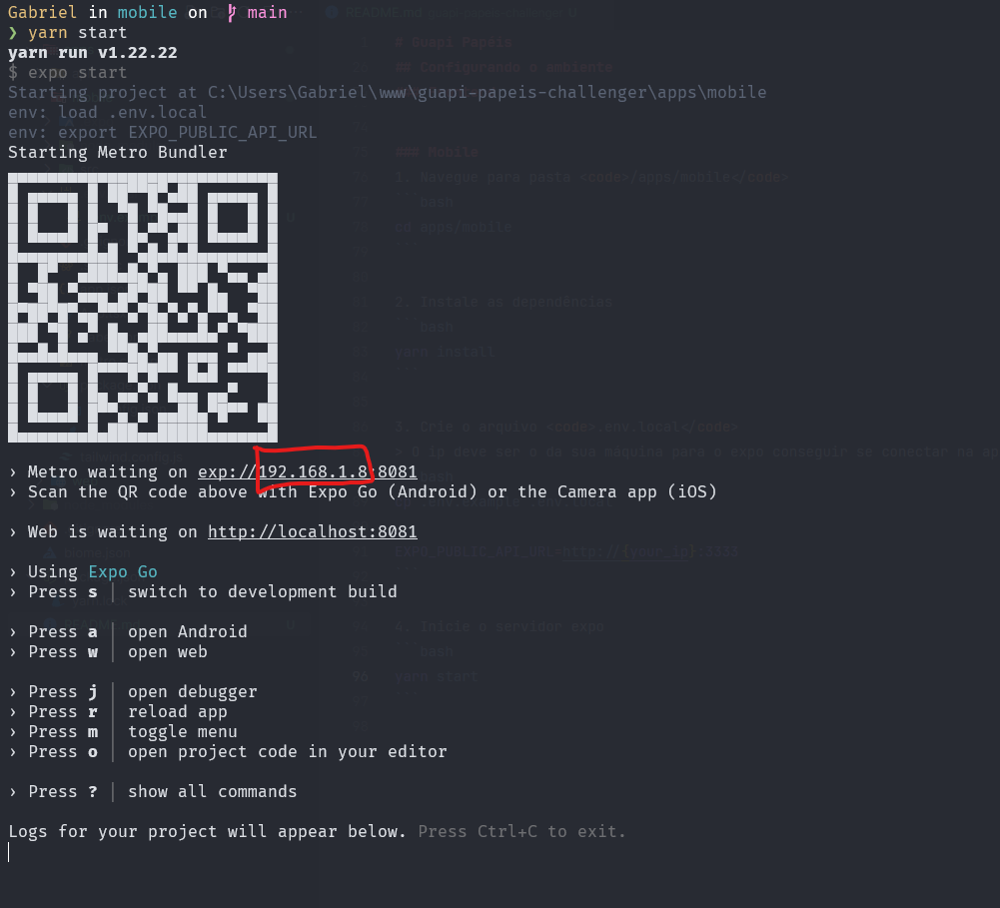

# Guapi Papéis
> Uma aplicação de cadastro de produtos multiplataforma para um teste na guapi

## Estrutura do projeto
```bash
├── apps/
│ ├── api/
│ ├── web/
│ ├── mobile/
```

## Ambiente 🛠️
| Biblioteca  | Ambiente | Descrição |
| ------------- | ------------- | ------------- |
| Node 20.x | Front, Back e Mobile | Runtime javascript |
| Typescript | Front, Back e Mobile | Superset javascript para tipagem estática |
| Zod | Front, Back e Mobile | Biblioteca de validação de dados |
| BiomeJs | Front, Back e Mobile | Ferramenta para padronização de código |
| Express | Back | Framework node para criação de rest api |
| Prisma | Back | ORM node |
| SqLite | Back | Banco de dados |
| Next14 | Front | Framework web javascript |
| Tailwind | Front, Mobile | Motor CSS |
| Expo | Mobile | Framework react native |

## Configurando o ambiente

### Backend
1. Navegue para pasta <code>/apps/api</code>
```bash
cd apps/api
```

2. Instale as dependências
```bash
yarn install
```

3. Rode as migrations
```bash
yarn prisma migrate dev
```

4. Crie o seed para dados fictícios
```bash
yarn seed
```

5. Inicie o servidor
```bash
yarn dev
```

### Frontend
1. Navegue para pasta <code>/apps/web</code>
```bash
cd apps/web
```

2. Instale as dependências
```bash
yarn install
```

3. Crie o arquivo <code>.env.development.local</code>
```bash
cp .env.example .env.development.local
```

4. Inicie o projeto
```bash
yarn dev
```

### Mobile
1. Navegue para pasta <code>/apps/mobile</code>
```bash
cd apps/mobile
```

2. Instale as dependências
```bash
yarn install
```

3. Crie o arquivo <code>.env.local</code>
> O ip deve ser o da sua máquina para o expo conseguir se conectar na api
```bash
cp .env.example .env.local

EXPO_PUBLIC_API_URL=http://{your_ip}:3333
```

4. Inicie o servidor expo
```bash
yarn start
```

> [!NOTE]
> Caso tenha dúvida sobre qual o seu ip, o servidor expo exibe ao iniciá-lo
